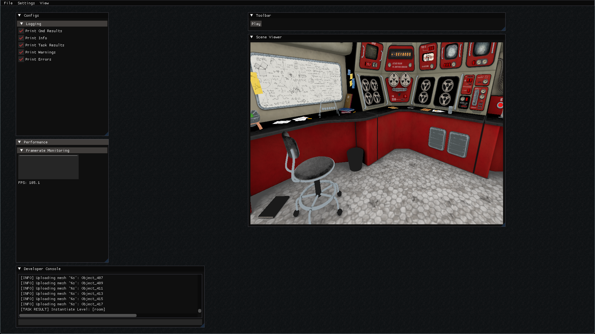

### WARNING: Currently in pre-release, not ready for full application development. License TBD, not currently available for application licensing.

Wind-Up is a 3D game engine currently in early development with a focus on radical modularity, experimental game development, and broad adoptability. The engine is currently an independent project by @TW-Starbuyer.

##### Current Modules:
- devices
- ecs
- levels
- profiler
- renderer
- resources
- threading
- time
- user_io
- windowing

##### Current Features:
The engine currently features an SDL3-GPU renderer, FLECS entity-component system, and an ImGUI based UI among others.

##### Planned Features:
Custom Vulkan renderer, Jolt physics system, full multithreading, full game level editor, and Lua scripting among others.

##### Assets
Secret Area-52 Room - https://skfb.ly/oLtSy

##### Building
Wind-Up uses the CMake build system for portability. The engine has been tested on x86 CPUs thus far. CMake fetch is used for non-packaged dependencies so it might take a little while at initial build-time. Just clone the repository and build the "Wind-Up" target.
